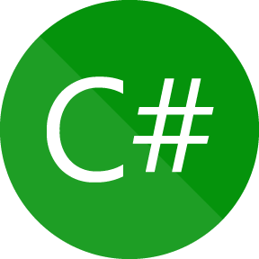
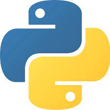
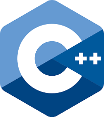
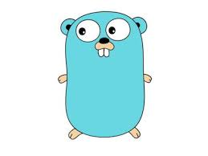

<!--suppress ALL -->

# 🤸 ஐ Stacker ஐ  <a href="https://twitter.com/StackerDesu"></a>


```Rust
#![no_std] // Minimal kernel
#![no_main]
use core::panic::PanicInfo;
#[panic_handler]
fn panic(_info: &PanicInfo) -> ! { loop {} }
#[no_mangle]
pub extern "C" fn _start() -> ! {
    let message = "Hi, I am Stacker!"; // ☬
    let buffer = 0xb8000 as *mut u8;
    for (i, &b) in message.as_bytes().iter().enumerate() {
        unsafe { // ☈
            *buffer.offset(i as isize * 2) = b;
            *buffer.offset(i as isize * 2 + 1) = 0xb;
        }
    }
    loop {}
}
```

# 📕 ❀ Languages ❀

<code></code>
<code></code>
<code></code>
<code></code>
<code></code>
<code></code>

# 📃 〄 Analysis 〄


# 📞 ❅ Contact ❅

```text
Email: mistyraincloudservice@gmail.com
Twitter: @StackerDesu
Github: @StackerDesu
```

[](https://github.com/StackerDesu)
