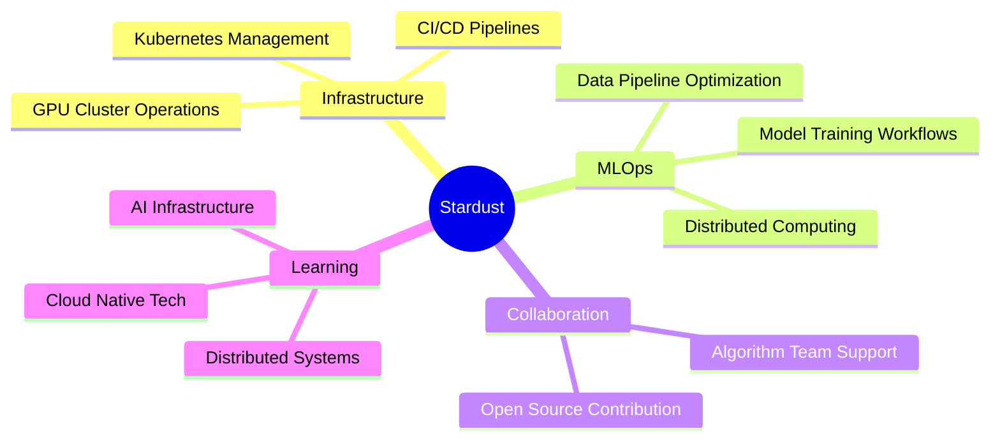

<!-- GitHub Profile README - Stardust -->

<div align="center">

<!-- Dynamic Typing Header -->
[](https://git.io/typing-svg)


</div>

---

> 星尘纵易散,银汉自长盈。清辉苍穹倾,同歌寥廓永夜明。

---

## About Me

<table>
<tr>
<td width="60%">

> Sophomore student passionate about **Cloud Native** infrastructure and **High Performance Computing**. Currently working at **39 AI / FishAudio** as an Infrastructure Engineer, specializing in GPU cluster operations at scale.
>
> Previously an **Audio Algorithm Engineer** focusing on TTS/SVC model development. Transitioned to Infrastructure to build the systems that power AI — from bare-metal GPU clusters to Kubernetes-orchestrated training pipelines.

</td>
<td width="40%" align="center">

```
    Stardust
    ═══════════════════════
    Sophomore
    Infra Engineer
    FishAudio
    Cloud Native
    HPC & GPU Cluster
    Ex-Audio Algorithm
    ═══════════════════════
```

</td>
</tr>
</table>

---

## Tech Stack

<div align="center">

<!-- Infrastructure -->


<!-- Programming -->
<br/>


<!-- MLOps -->
<br/>


</div>

---

## Featured Projects

> Projects from the FishAudio team that I contribute to

<div align="center">

<!-- FishAudio Organization Stats -->
<a href="https://github.com/fishaudio">

</a>


<br/><br/>

| Project | Description | Stars |
|---------|-------------|-------|
| [**fish-speech**](https://github.com/fishaudio/fish-speech) | SOTA Open Source TTS |  |
| [**so-vits-svc**](https://github.com/svc-develop-team/so-vits-svc) | SoftVC VITS Singing Voice Conversion |  |
| [**Bert-VITS2**](https://github.com/fishaudio/Bert-VITS2) | VITS2 backbone with multilingual-bert |  |
| [**ZeroBot-Plugin**](https://github.com/FloatTech/ZeroBot-Plugin) | OneBot plugin based on ZeroBot |  |
| [**fish-diffusion**](https://github.com/fishaudio/fish-diffusion) | An easy to understand TTS / SVS / SVC framework |  |

</div>

---

## What I Do

<div align="center">

<!-- Scale at a glance -->


</div>

<table>
<tr>
<td>

> Operating **100–1,000+ GPU** training clusters, **petabyte-scale** storage, and **100Gbps+ public network** (our own ASN **AS402567**) for FishAudio. Dual-stack scheduling with **Slurm** (HPC/bare-metal training) and **Kubernetes** (services & MLOps), backed by **Ceph** and friends — the substrate beneath our production TTS models.

</td>
</tr>
</table>

<div align="center">


```mermaid
mindmap
  root((Stardust))
    Infrastructure
      GPU Cluster Operations
      Kubernetes Management
      CI/CD Pipelines
    MLOps
      Data Pipeline Optimization
      Model Training Workflows
      Distributed Computing
    Collaboration
      Algorithm Team Support
      Open Source Contribution
    Learning
      Distributed Systems
      Cloud Native Tech
      AI Infrastructure
```

</div>

---

## GitHub Stats

<div align="center">


<br/>


<br/><br/>


</div>

---

## Contact

<div align="center">

[](mailto:stardust@fish.audio)
[](https://space.bilibili.com/163056936)
[](https://github.com/Stardust-minus)

</div>

---

<div align="center">

<!-- Visitor Counter -->


> *"In the world of Infra, every star matters."*

**Building the infrastructure for the AI era**

</div>
