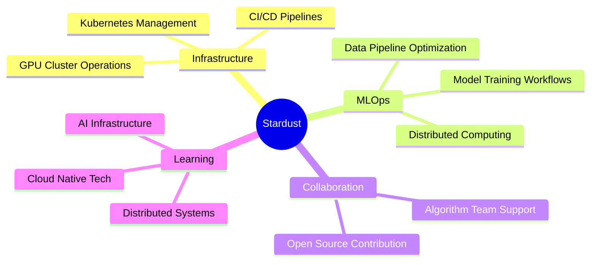

<!-- GitHub Profile README - Stardust -->

<div align="center">

<!-- Dynamic Typing Header -->
[](https://git.io/typing-svg)


</div>

---

## 🚀 About Me / 关于我

<table>
<tr>
<td width="60%">

**English**

> Sophomore student passionate about **Cloud Native** infrastructure and **High Performance Computing**. Currently working at **39 AI / FishAudio** as an Infrastructure Engineer, specializing in GPU cluster operations at scale.
>
> Previously an **Audio Algorithm Engineer** focusing on TTS/SVC model development. Transitioned to Infrastructure to build the systems that power AI — from bare-metal GPU clusters to Kubernetes-orchestrated training pipelines.

**中文**

> 大二在读，专注于**云原生**基础设施与**高性能计算**。现任职于 **39 AI / FishAudio** 担任基础架构工程师，负责大规模 GPU 集群运维。
>
> 曾任**音频算法工程师**，从事 TTS/SVC 语音合成模型研发。后转型基础设施，致力于构建支撑 AI 的底层系统 —— 从裸机 GPU 集群到 Kubernetes 编排的训练流水线。

</td>
<td width="40%" align="center">

```
    ⭐ Stardust ⭐
    ═══════════════════════
    🎓 Sophomore
    💻 Infra Engineer
    🐟 FishAudio
    ☁️  Cloud Native
    ⚡ HPC & GPU Cluster
    🔊 Ex-Audio Algorithm
    ═══════════════════════
```

</td>
</tr>
</table>

---

## 🔧 Tech Stack / 技术栈

<div align="center">

<!-- Infrastructure -->


<!-- Programming -->
<br/>


<!-- MLOps -->
<br/>


</div>

---

## 🌟 Featured Projects / 主要项目

> Projects I've contributed to / 我参与的开源项目

<div align="center">

<!-- FishAudio Organization Stats -->
<a href="https://github.com/fishaudio">

</a>


<br/><br/>

| Project | Description | Stars |
|---------|-------------|-------|
| [**fish-speech**](https://github.com/fishaudio/fish-speech) | SOTA Open Source TTS |  |
| [**so-vits-svc**](https://github.com/svc-develop-team/so-vits-svc) | SoftVC VITS Singing Voice Conversion |  |
| [**Bert-VITS2**](https://github.com/fishaudio/Bert-VITS2) | VITS2 backbone with multilingual-bert |  |
| [**ZeroBot-Plugin**](https://github.com/FloatTech/ZeroBot-Plugin) | 基于 ZeroBot 的 OneBot 插件 |  |
| [**fish-diffusion**](https://github.com/fishaudio/fish-diffusion) | An easy to understand TTS / SVS / SVC framework |  |

</div>

---

## 💼 What I Do / 工作内容

<div align="center">


```mermaid
mindmap
  root((Stardust))
    Infrastructure
      GPU Cluster Operations
      Kubernetes Management
      CI/CD Pipelines
    MLOps
      Data Pipeline Optimization
      Model Training Workflows
      Distributed Computing
    Collaboration
      Algorithm Team Support
      Open Source Contribution
    Learning
      Distributed Systems
      Cloud Native Tech
      AI Infrastructure
```

</div>

---

## 📫 Contact / 联系方式

<div align="center">

[](mailto:stardust@fish.audio)
[](https://space.bilibili.com/)
[](https://github.com/Stardust-minus)

</div>

---

<div align="center">

<!-- Visitor Counter -->


<!-- Quote -->
> *"In the world of Infra, every star matters."* ⭐

**✨ Building the infrastructure for the AI era / 为 AI 时代构建基础设施 ✨**

</div>
